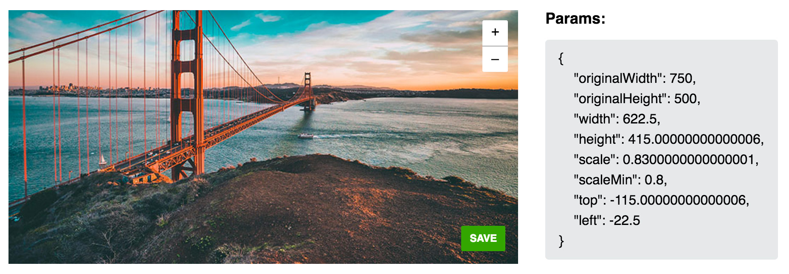

<p>
  
</p>

# Cover Editor

Tiny (2 kb gzipped) page cover editor (like FB does).

[](https://www.npmjs.com/package/cover-editor)
[](http://npm-stat.com/charts.html?package=cover-editor)
[](https://www.npmjs.com/package/cover-editor)


## Install

```bash
npm install --save cover-editor
```


## Overview

<p>
  
</p>


## Usage

```javascript
new CoverEditor(DOM_ELEMENT, {
  src: '/images/cover.jpg',
  navig: {
    scaleUp: DOM_ELEMENT,
    scaleDown: DOM_ELEMENT,
    save: DOM_ELEMENT,
    cancel: DOM_ELEMENT,
  },
  onSave: (params) => {},
  onCancel: () => {}
})
```


## Props

`new CoverEditor(DOM_ELEMENT, props)`

name | type | description
---- | ---- | -----------
src | String | Path to cover image
storageKey | String | LocalStorage key for saving and loading `initialParams`
initialParams | Object | Initial params to load image position and scaling. Check structure in **Note #1**
navig | Object | Set of elements to navigate in Cover. `scaleUp` and `scaleDown` for scaling image. `save` triggers `onSave` handler. `cancel` triggers `onCancel` handler.
onSave | Function | Handler which has one argument. Check structure in **Note #1**
onCancel | Function |


#### Note #1

```javascript
{
  originalWidth: Number,
  originalHeight: Number,
  initialParams: {
    originalWidth: Number,
    originalHeight: Number,
    width: Number,
    height: Number,
    scale: Number,
    scaleMin: Number,
    top: Number,
    left: Number
  },
  cropArea: {
    width: Number,
    height: Number,
    top: Number,
    left: Number,
  }
}
```


## Example

[pavelivanov.info/projects/cover-editor](http://pavelivanov.info/projects/cover-editor)
